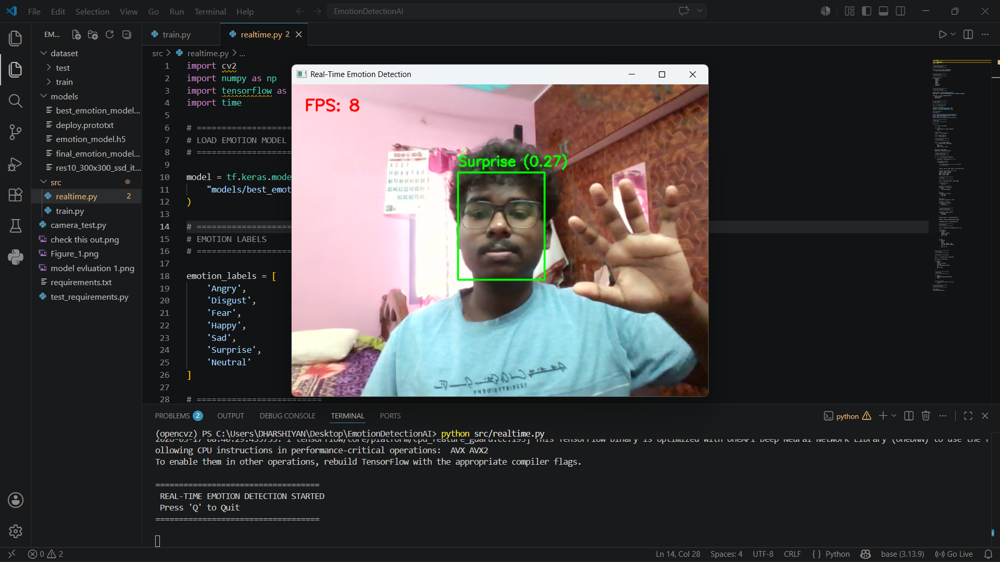
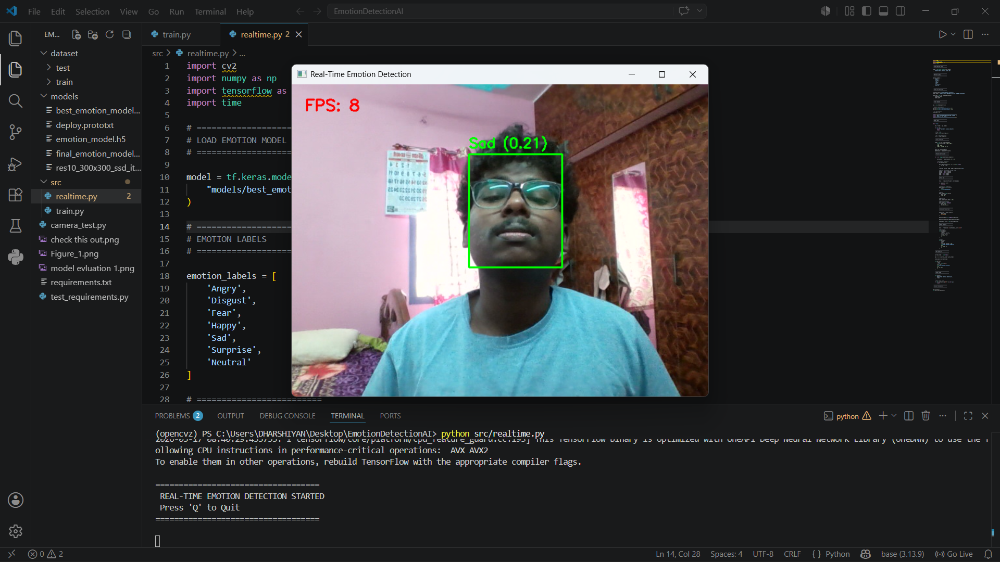
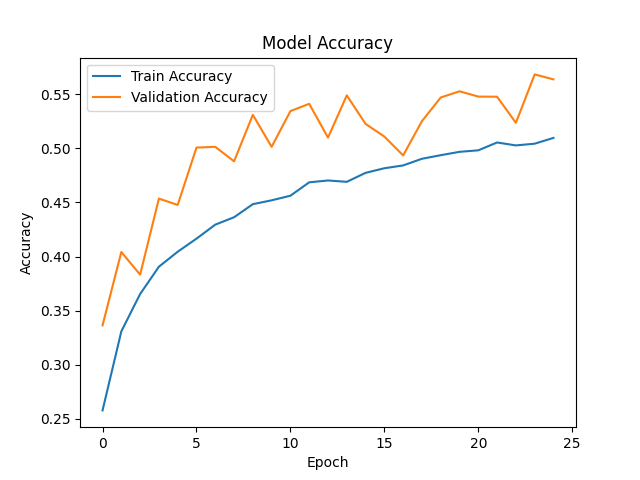
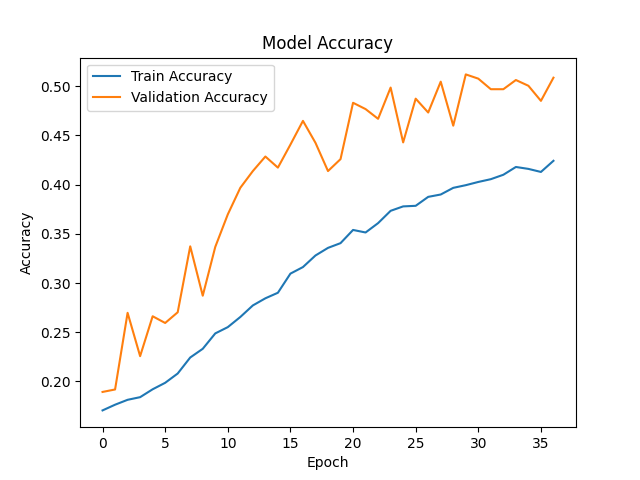

# Real-Time Multi Emotion Detection System

## Project Description

An AI-powered real-time facial emotion recognition system developed using TensorFlow, OpenCV, and Deep Learning. The system detects human facial expressions from live webcam video streams and classifies them into multiple emotional categories in real time.

The project uses a Convolutional Neural Network (CNN) trained on the FER2013 dataset for emotion classification and OpenCV DNN-based face detection for fast and optimized real-time performance.

This project demonstrates practical applications of:

* Computer Vision
* Deep Learning
* Real-Time AI Inference
* Facial Expression Recognition
* Human Emotion Analysis

---

# Features

* Real-time webcam emotion detection
* Multiple emotion classification
* Optimized OpenCV DNN face detector
* TensorFlow CNN emotion classifier
* FPS counter for performance monitoring
* Prediction stabilization using emotion smoothing
* Low-latency inference pipeline
* Lightweight and beginner-friendly architecture
* Model checkpoint saving
* Data augmentation support

---

# Emotions Detected

| Emotion  |
| -------- |
| Angry    |
| Disgust  |
| Fear     |
| Happy    |
| Sad      |
| Surprise |
| Neutral  |

---

# Technologies Used

| Technology      | Purpose                   |
| --------------- | ------------------------- |
| Python          | Core Programming Language |
| TensorFlow      | Deep Learning Framework   |
| OpenCV          | Real-Time Computer Vision |
| NumPy           | Numerical Processing      |
| Matplotlib      | Visualization             |
| Scikit-learn    | Class Weight Computation  |
| FER2013 Dataset | Emotion Training Dataset  |

---

# Project Architecture

```text
Webcam Input
      ↓
OpenCV DNN Face Detection
      ↓
Face Preprocessing
      ↓
CNN Emotion Classification
      ↓
Prediction Smoothing
      ↓
Real-Time Emotion Display
```

---

# Project Structure

```text
EmotionDetectionAI/
│
├── dataset/
│   ├── train/
│   └── test/
│
├── models/
│   ├── best_emotion_model.h5
│   ├── deploy.prototxt
│   └── res10_300x300_ssd_iter_140000.caffemodel
│
├── src/
│   ├── train.py
│   └── realtime.py
│
├── outputs/
│
├── requirements.txt
│
└── README.md
```

---

# Dataset

Dataset Used:

FER2013 - Facial Expression Recognition Dataset

Dataset Link:
[https://www.kaggle.com/datasets/msambare/fer2013](https://www.kaggle.com/datasets/msambare/fer2013)

---

# Installation Guide

## 1. Clone Repository

```bash
git clone https://github.com/your-username/EmotionDetectionAI.git
```

---

## 2. Navigate to Project Folder

```bash
cd EmotionDetectionAI
```

---

## 3. Create Virtual Environment

```bash
python -m venv venv
```

---

## 4. Activate Virtual Environment

### Windows

```bash
venv\Scripts\activate
```

---

## 5. Install Dependencies

```bash
pip install -r requirements.txt
```

---

# Train the Model

```bash
python src/train.py
```

---

# Run Real-Time Detection

```bash
python src/realtime.py
```

---

# Performance

| Metric              | Result    |
| ------------------- | --------- |
| Validation Accuracy | ~60%–75%  |
| Real-Time FPS       | 15–30 FPS |
| Emotion Classes     | 7         |
| Detection Type      | Real-Time |

---

# Optimization Techniques Used

* Data Augmentation
* Batch Normalization
* Dropout Regularization
* Emotion Prediction Smoothing
* OpenCV DNN Face Detection
* Model Checkpoint Saving
* Early Stopping
* Class Weight Balancing

---

# Future Improvements

* MobileNetV2 Transfer Learning
* Multi-face emotion detection
* TensorFlow Lite optimization
* GPU acceleration
* Flask/Streamlit deployment
* Emotion analytics dashboard
* Emotion history tracking
* Voice emotion analysis integration

---

# Screenshots

## Real-Time Emotion Detection

<p align="center">
  
</p>

<p align="center">
  
</p>

## Training Accuracy

<p align="center">
  
</p>

## Training Loss

<p align="center">
  
</p>

# Applications

* Smart Surveillance Systems
* Human Behavior Analysis
* AI-Based Customer Analytics
* Emotion-Aware Assistants
* Mental Health Monitoring
* Educational AI Systems
* Interactive AI Applications

---

# Learning Outcomes

This project helped in understanding:

* Deep Learning Fundamentals
* CNN Architecture Design
* Real-Time Computer Vision
* TensorFlow Model Training
* OpenCV Face Detection
* Model Optimization Techniques
* Emotion Recognition Systems

---

# Author

Your Name

AI & Machine Learning Enthusiast

GitHub: [https://github.com/your-username](https://github.com/dharshiyan)

LinkedIn: [https://linkedin.com/in/your-profile](https://linkedin.com/in/dharshiyan)

---

# License

This project is developed for educational and research purposes.

---

# GitHub Repository Tips

For a professional GitHub repository:

* Add screenshots
* Upload sample output videos
* Keep code clean and modular
* Add proper comments
* Use meaningful commit messages
* Add project architecture diagram
* Include requirements.txt
* Add installation instructions

---

# Recommended Repository Name

```text
Real-Time-Multi-Emotion-Detection-System
```

---

# Recommended GitHub Topics

```text
artificial-intelligence
computer-vision
deep-learning
emotion-detection
facial-expression-recognition
tensorflow
opencv
cnn
machine-learning
python
real-time-ai
```

---

# Recommended Commit Messages

```text
Initial project setup
Added CNN emotion training pipeline
Implemented real-time emotion detection
Integrated OpenCV DNN face detector
Added prediction smoothing
Optimized real-time inference pipeline
Updated README documentation
```

---

# Professional Short Project Description

```text
AI-powered real-time facial emotion recognition system using TensorFlow, OpenCV, and CNN-based deep learning for live webcam emotion analysis.
```

---

# Professional Long Project Description

```text
Developed a real-time facial emotion detection system using TensorFlow and OpenCV capable of recognizing multiple human emotions from live webcam streams. The project utilizes a CNN trained on the FER2013 dataset along with OpenCV DNN face detection for optimized real-time inference and low-latency performance.
```
